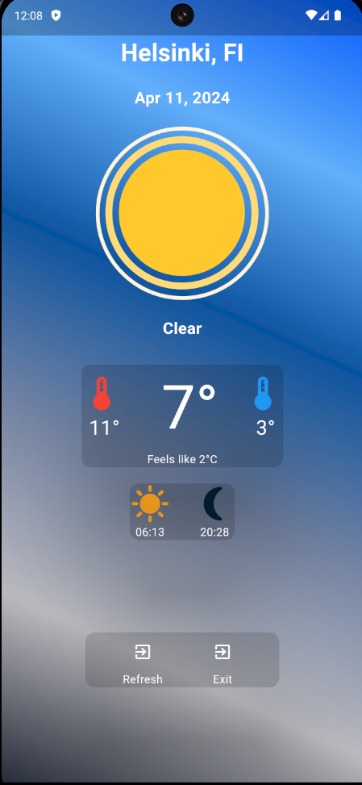
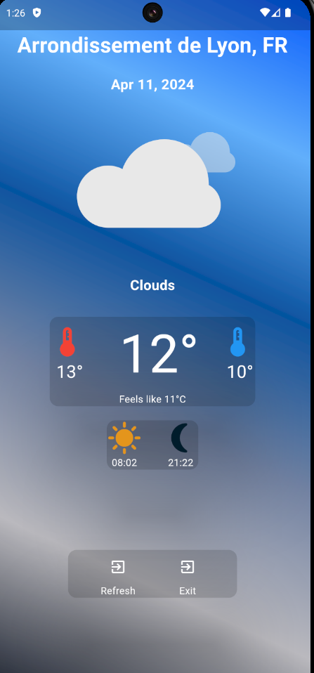

# Flutter Weather App

A Weather app made using Flutter and the [OpenWeatherMap](https://openweathermap.org) API

The weather animations are from [Lottie](https://lottiefiles.com/vdr0uy2wwsoljqtc)

The weather app includes extra features such as a refresh button that checks the users location and updates the app accordingly without the user needing to relaunch the app.

### **The project includes the following packages:**

[intl](https://pub.dev/packages/intl) | [lottie](https://pub.dev/packages/lottie) | [http](https://pub.dev/packages/lottie) | [geocoding](https://pub.dev/packages/geocoding) | [geolocator](https://pub.dev/packages/geolocator)

## Flutter Project Setup

Follow these steps to set up the Flutter project using the code from this GitHub repository.

## 1. Create a new Flutter project

Open a terminal and run the following commands:

```bash
flutter create weather_app
cd weather_app
```

> Note if you name your project something else than `weather_app`, the imports may not work and need to be changed to the correct name!

## 2. Copy the `assets` folder

Copy the `assets` folder and all its contents to the root ot the project

## 3. Replace the contents of the `lib` folder

Replace the contents of the `lib` folder with the contents of the `lib` folder in this github repo

## 4. Add Android location permissions

Navigate to `android > app > src > main > AndroidManifest.xml`

**Add the following lines to the top of the file in inside \<manifest xmlns:android="http://schemas.android.com/apk/res/android"> and before \<application>**
```xml
    <uses-permission android:name="android.permission.ACCESS_FINE_LOCATION" />
    <uses-permission android:name="android.permission.ACCESS_COARSE_LOCATION" />
```
**It should look something like this:**
```xml
<manifest xmlns:android="http://schemas.android.com/apk/res/android">
    <uses-permission android:name="android.permission.ACCESS_FINE_LOCATION" /> <!--Add this line-->
    <uses-permission android:name="android.permission.ACCESS_COARSE_LOCATION" /> <!--Add this line-->
    <application
        android:label="weather_app"
        <!--Rest of the file-->
```

## 5. Get and use your API key

**Go to OpenWeatherMap and sign in/sign up**

[https://home.openweathermap.org/api_keys]("https://home.openweathermap.org/api_keys")

**Copy an existing API key or generate a new one**

Paste the key into `lib > api_key.dart`

## 6. Replace the `pubspec.yaml` file

Delete the current `pubspec.yaml` file and copy the one from this repo to the root of your project

## 7. Install dependencies

```bash
flutter pub get
```

## 8. Run the app

```bash
flutter run
```

## The end result:





